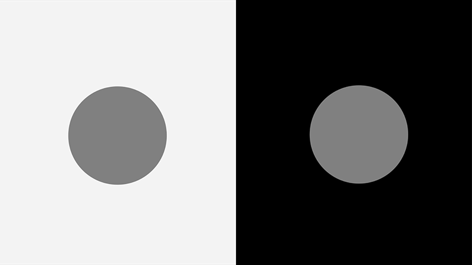
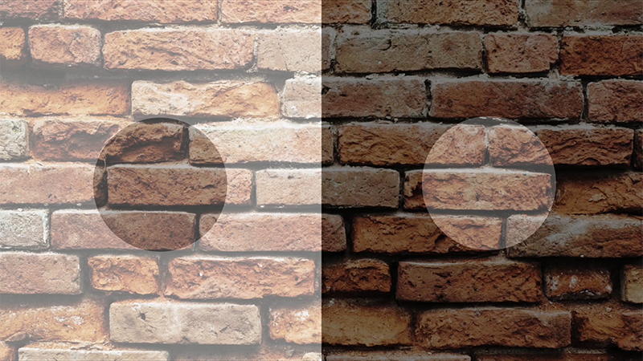

# Lab Exercise: Tissue Illusion
## Objectives
Re-create the _Tissue Contrast Illusion_ by Arthur G. Shapiro.

[animated gif here]

## What you'll learn in this lab
- Make `
` elements into circles with `border-radius`.
- Vertically centre elements with Flexbox and `margin: auto`.
- Create a split-colour background with custom gradient colour stops.
- Overlap a semi-transparent image with absolute positioning and `opacity`.

### 1. Vertically centre two equally spaced grey circles in the viewport.

[Spoilers](https://codepen.io/funwithcodeyyc/pen/RwWzQyz)

### 2. Create a left-to-right, split-colour background using custom gradient colour stops.

(Spoilers)[https://codepen.io/funwithcodeyyc/pen/WNQqMPR]

### 3. Overlap a full-viewport, semi-transparent image on top of the grey circles (and viewport background).

Spoilers
- [Declare a full-viewport css background image with Lorem Picsum](https://codepen.io/funwithcodeyyc/pen/VwvJXBa)
- [Absolutely position an image to the top left corner of the browser window](https://codepen.io/funwithcodeyyc/pen/ExVBLyV)

## Attributions
Illusions, Season 1 Episode 2: Brightness and Contrast
Available on Curiosity Stream